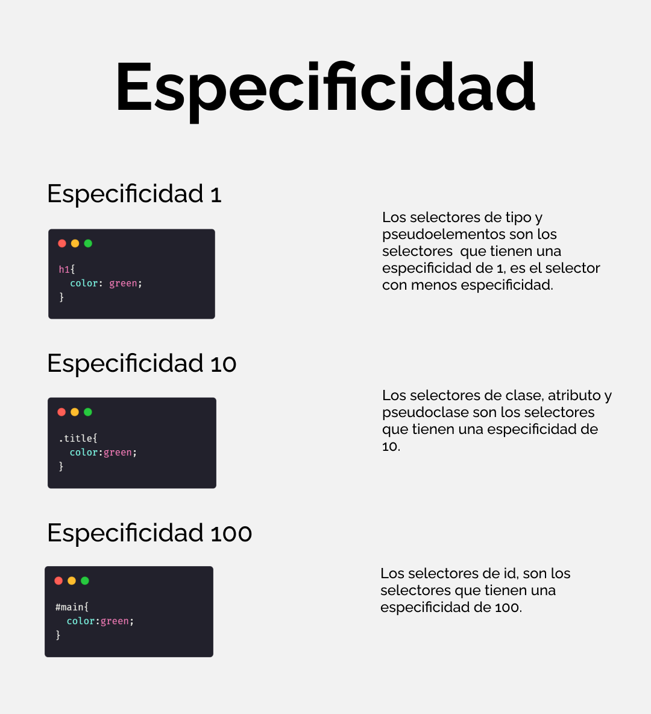

<center></center>

# Curso CSS

## ¿Qué es y para qué sirve CSS?

CSS (Cascading Style Sheets) es un lenguaje de estilos en cascada, este lenguaje nos
permite darle estilos a nuestro código HTML por medio de una regla de estilos, que
conlleva un selector, propiedad y valor. En pocas palabras, servirá para darle estilos a
nuestro código HTML.
***
## ¿Cuál es la estructura de CSS?

CSS es muy sencillo,trabaja con bloques de estilos que definen a que elementos se
les aplicarán los estilos de dicho bloque. Esto se hace con un selector, propiedad y
valor.

```css
<!-- Estructura -->

selector{
    propiedad:valor;
    propiedad:valor;
}

<!-- Ejemplo --->

.cuadrado {
    height: 10cm; // Definide el alto.
    width: 10cm; // Definide el ancho.
    background-color: steelblue; // Define el color de fondo.
    color: white; // Define el color de texto.
    border: 2px solid black; // Borde.
}

```
## **Selectores**

Los selectores es la primero parte de una regla **CSS** define que elementos **HTML** va a ser modificados. 

### Tipo de Selectores
1. **Selectores de Tipo:** Selecciona de nombre o de etiqueta.
   ```css
   body{
       color: green;
   }
   ``` 
2. **Selector de Clases:** Selecciona todos los nombres que este en el atributo **class**, se llama con un punto.
   ```html
   <!-- HTML -->
    <p class="bold">Negrilla</p>
   ``` 
   ```css
   <!--css-->
   .bold{
       color: green;
   }
   ```
3. **Selector de ID:** Selecciona todos los nombres que este en el atributo **id**, se llama con un #.
   **PD:** Los id son idetificadores unicos de cada elemento.

    ```html
   <!-- HTML -->
    <p id="bold">Negrilla</p>
   ``` 
   ```css
   /*css*/
   #bold{
       color: green;
   }
   ```

4. **Selector Universal:** Selecciona todos los elemetos del HTML, se coloca al principio de la hoja de estilos se utiliza un asterisco *.
```css
*{
    font-size:16px;
}
```

5. **Selectores Combinadores:** Son la combinación de dos o mas selectores basicos del mismo tipo. 

    5.1. **Combinador de descendiente:** Este Combinador es representado por un espacio en blanco, combina dos selectores donde el primero debe ser el acentro del segundo selector.

    5.2.**Combinador de Hijos directos:** Este combinador es representado por un `>`, combina dos selectores donde el primero debe ser el padre directo del segundo selector.

    5.3.**Combinador de Hermano Adyacente:** Este combinador es representado por un `+`, combina dos selectores donde el primero debe ser el hermano adyacente.

     5.4.**Combinador de Hermanos Generales:** Este combinador es representado por una virgulilla `~` ó ALT + 126, combina dos selectores donde el segundo selector debe ser el hermano siguiente del primero selector.

6. **Selector de Atributo:** Selecciona un atributo y se repreneta con los []  y dentro el atributo.

 ```css
 [value="holamundo"]{
     color: yellow;
 }
/*Se utiliza para encontrar una palabra expecifica*/
 [value~="hola"]{
     color: yellow;
 }
/*no permite encontrar la palabra al principio o inicie - ALT + 94*/
  [value^="hola"]{
     color: yellow;
 }
/*no permite encontrar la palabra al final o termine*/
[value$="hola"]{
     color: yellow;
 }
/*no permite encontrar que contenga el elemento*/
 [value*="hola"]{
     color: yellow;
 }
 ``` 

## HERENCIA, ESPECIFICIDAD Y CASCADAD

**La cascada** es una manera de determinar que selectores van aplicar los estilos en caso que haya más de un selector que cambia un mismo elemento y de un diferente estilo.

El ultimo estilo declarado sera el que se tome.

**La Especificidad** es el metodo primodial que define que estilos se aplicaran primero.



El valor `!important` rompe la especificidad pero no es recomendable porque es una mala practica, igual que los ID y los estilos en lineas.

**La herencia** es la caractericas que nos permite hereda los estilos del contenedor principal a los hijos.

`inherit` es el valor que fuerza la herencia del padre.

## Metodología CSS: (BEM) Block Element Modifier

BEM (Block Element Modifier) es una metodología que nos proporciona una manera
de nombrar a nuestras clases en HTML para posteriormente poder usarlo en CSS,
BEM nos ayudará a mantener nuestro código flexible, modular y sencillo. Sobre todo
a lidiar con problemas sobre especificidad.
BEM significa Block Element Modifier, esto es debido a que todas las clases que
escribiremos se regirán por estas 3 partes.

### Bloque

Es una parte independiente en nuestro HTML, no necesita de otros elementos para
existir. Por ejemplo, una galería de imágenes o un menú, no necesita de otros
elementos para existir.
Los bloques tienen el nombre de lo que representará, ejemplo "header, menu,
galeria, footer"

### Elemento

Un elemento siempre estará dentro de un bloque, debido a que es parte de él y es
dependiente del bloque, por ejemplo una imágen necesita una galería de imagenes
para existir, o un enlace necesita un menu para existir.
Los elementos tendrán el nombre primero de el bloque al que pertenece, dos
guiones bajos y despues el nombre de lo que representará ejemplo: "header__title,
menu__item, galeria__img, footer__img"

### Modificador

Los modificadores son usados en elementos o bloques, se usan para representar una
característica diferente que tendrá el modificador o elemento.
Los modificadores tendrán el nombre del bloque o del elemento, después otra vez el
nombre del elemento, dos guiones medios y la característica diferente que tendrá
este bloque o elemento.
Ejemplo: "boton—active" "header—wave".


