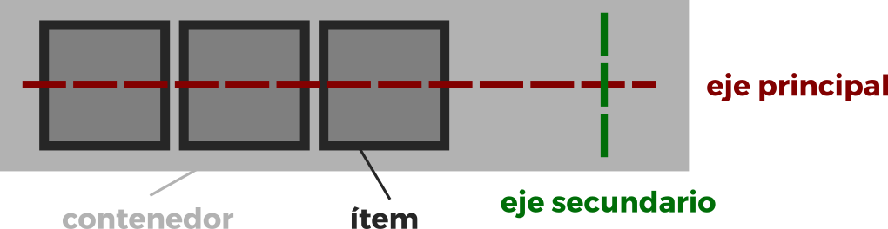

<center></center>

# Curso CSS

## ¿Qué es y para qué sirve CSS?

CSS (Cascading Style Sheets) es un lenguaje de estilos en cascada, este lenguaje nos
permite darle estilos a nuestro código HTML por medio de una regla de estilos, que
conlleva un selector, propiedad y valor. En pocas palabras, servirá para darle estilos a
nuestro código HTML.
***
## ¿Cuál es la estructura de CSS?

CSS es muy sencillo,trabaja con bloques de estilos que definen a que elementos se
les aplicarán los estilos de dicho bloque. Esto se hace con un selector, propiedad y
valor.

```css
<!-- Estructura -->

selector{
    propiedad:valor;
    propiedad:valor;
}

<!-- Ejemplo --->

.cuadrado {
    height: 10cm; // Definide el alto.
    width: 10cm; // Definide el ancho.
    background-color: steelblue; // Define elcolor de fondo.
    color: white; // Define elcolor de texto.
    border: 2px solid black; // Borde.
}

```
## **Selectores**

Los selectores es la primero parte de una regla **CSS** define que elementos **HTML** va a ser modificados. 

### Tipo de Selectores
1. **Selectores de Tipo:** Selecciona de nombre o de etiqueta.
   ```css
   body{
       color: green;
   }
   ``` 
2. **Selector de Clases:** Selecciona todos los nombres que este en el atributo **class**, se llama con un punto.
   ```html
   <!-- HTML -->
    <p class="bold">Negrilla</p>
   ``` 
   ```css
   <!--css-->
   .bold{
       color: green;
   }
   ```
3. **Selector de ID:** Selecciona todos los nombres que este en el atributo **id**, se llama con un #.
   **PD:** Los id son idetificadores unicos de cada elemento.

    ```html
   <!-- HTML -->
    <p id="bold">Negrilla</p>
   ``` 
   ```css
   /*css*/
   #bold{
       color: green;
   }
   ```

4. **Selector Universal:** Selecciona todos los elemetos del HTML, se coloca al principio de la hoja de estilos se utiliza un asterisco *.
```css
*{
    font-size:16px;
}
```

5. **Selectores Combinadores:** Son la combinación de dos o mas selectores basicos del mismo tipo. 

    5.1. **Combinador de descendiente:** Este Combinador es representado por un espacio en blanco, combina dos selectores donde el primero debe ser el acentro del segundo selector.

    5.2.**Combinador de Hijos directos:** Este combinador es representado por un `>`, combina dos selectores donde el primero debe ser el padre directo del segundo selector.

    5.3.**Combinador de Hermano Adyacente:** Este combinador es representado por un `+`, combina dos selectores donde el primero debe ser el hermano adyacente.

     5.4.**Combinador de Hermanos Generales:** Este combinador es representado por una virgulilla `~` ó ALT + 126, combina dos selectores donde el segundo selector debe ser el hermano siguiente del primero selector.

6. **Selector de Atributo:** Selecciona un atributo y se repreneta con los []  y dentro el atributo.

 ```css
 [value="holamundo"]{
     color: yellow;
 }
/*Se utiliza para encontrar una palabra expecifica*/
 [value~="hola"]{
     color: yellow;
 }
/*no permite encontrar la palabra al principio o inicie - ALT + 94*/
  [value^="hola"]{
     color: yellow;
 }
/*no permite encontrar la palabra al final o termine*/
[value$="hola"]{
     color: yellow;
 }
/*no permite encontrar que contenga el elemento*/
 [value*="hola"]{
     color: yellow;
 }
 ``` 

## HERENCIA, ESPECIFICIDAD Y CASCADAD

**La cascada** es una manera de determinar que selectores van aplicar los estilos en caso que haya más de un selector que cambia un mismo elemento y de un diferente estilo.

El ultimo estilo declarado sera el que se tome.

**La Especificidad** es el metodo primodial que define que estilos se aplicaran primero.


El valor `!important` rompe la especificidad pero no es recomendable porque es una mala practica, igual que los ID y los estilos en lineas.

**La herencia** es la caractericas que nos permite hereda los estilos del contenedor principal a los hijos.

`inherit` es el valor que fuerza la herencia del padre.

## Metodología CSS: (BEM) Block Element Modifier

BEM (Block Element Modifier) es una metodología que nos proporciona una manera
de nombrar a nuestras clases en HTML para posteriormente poder usarlo en CSS,
BEM nos ayudará a mantener nuestro código flexible, modular y sencillo. Sobre todo
a lidiar con problemas sobre especificidad.
BEM significa Block Element Modifier, esto es debido a que todas las clases que
escribiremos se regirán por estas 3 partes.

### Bloque

Es una parte independiente en nuestro HTML, no necesita de otros elementos para
existir. Por ejemplo, una galería de imágenes o un menú, no necesita de otros
elementos para existir.
Los bloques tienen el nombre de lo que representará, ejemplo "header, menu,
galeria, footer"

```html
    <nav class="nav">
    </nav>
```

### Elemento

Un elemento siempre estará dentro de un bloque, debido a que es parte de él y es
dependiente del bloque, por ejemplo una imágen necesita una galería de imagenes
para existir, o un enlace necesita un menu para existir.
Los elementos tendrán el nombre primero de el bloque al que pertenece, dos
guiones bajos y despues el nombre de lo que representará ejemplo: "header__title,
menu__item, galeria__img, footer__img"

```html
    <nav class="nav">
        
    </nav>   
        
```

### Modificador

Los modificadores son usados en elementos o bloques, se usan para representar una
característica diferente que tendrá el modificador o elemento.
Los modificadores tendrán el nombre del bloque o del elemento, después otra vez el
nombre del elemento, dos guiones medios y la característica diferente que tendrá
este bloque o elemento.
Ejemplo: "boton—active" "header—wave".

```html
    <a href="#" class="nav__link">Inicio</a>
    <a href="#" class="nav__link">Acerca de</a>
    <a href="#" class="nav__link nav__link--active">Contacto</a>
```

## Box Model

Todos los elementos debe ser tratados como cajas, rectangulos y cuadrados.
Es la estructura que compone una caja o elmento en css que se divide en capas.


### Propiedades Box Model

1. **WIDTH:** Nos permite dar una anchura al elemento o cajas.
    1.1. ***max-width:*** Nos permite dar un ancho maximo al elemento.
    1.2. ***min-width:*** Nos permite dar un ancho minimo del elemento.
2. **HEIGHT:** Nos permita dar una altura al elemento o cajas.
    2.1. ***max-height:*** Nos permite dar una altura maxima al elemento.
    2.2. ***min-height:*** Nos permite dar una altura minima del elemento.
3. **PADDING:** Es una capa de relleno que separa el borde de la caja del contenido.
   3.1. ***padding-top:*** Nos permite agregar relleno en la parte superior del elemento.
   3.2. ***padding-right:*** Nos permite agregar relleno en la parte derecha del elemento.
   3.3. ***padding-bottom:*** Nos permite agregar relleno en la parte inferior del elemento.
   3.4. ***padding-left:*** Nos permite agregar relleno en la parte izquierda del elemento.
4. **BORDER:** Es una capa que modifica el tamaño de los elementos es decir el tamño de la linea del borde de la caja.
El borde en CSS tiene 3 caracteristica en alcho el estido y el color, y para que funcione bien debe tener dos carcteristicas fundamentales que son el ancho y el estilo del borde.
    4.1. ***border-top:*** Cambiar el borde superior.   
    4.2. ***border-right:*** Cambia el borde derecho.     
    4.3. ***border-bottom:*** Cambia el borde inferior.        
    4.4. ***border-left:*** Cambia el borde izquierdo.         
    4.5. ***border-width:*** Nos permite definir el ancho del borde y es un shorthand.
        4.5.1. ***thin:*** Es un valor de border-width que crea un linea fina casi inpersectible.
        4.5.2. ***medium:*** Es un valor de border-width que crea una linea un poco mas gruesa.
        4.5.3. ***thick:*** Es un valor de border-width que crea una linea mas gruesa.
4.6. ***border-style:*** Define el estilo de la linea.          
4.6.1. ***solid:*** Crea una linea solida.      
4.6.2. ***dotted:*** Crea una linea punteada.       
4.6.3. ***dashed:*** Crea una linea en guiones.     
4.6.4. ***double:*** Crea una linea con lineas dobles.      
4.6.5. ***groove:*** Crea un efecto de que estamos sumerjiendo el elemento.     
4.6.6. ***ridge:*** Crea un efecto de como si estuvieramos sacandolo.
4.7. ***border-color:*** Define el color de la linea.       

5. **MARGIN:** Permite establecer una sepracion en 4 direcciones entre dos o mas cajas.
   5.1. ***margin-top:*** Define el margen superiror.
   5.2. ***margin-right:*** Define el margen derecho.
   5.3. ***margin-bottom:*** Define el margen inferior.
   5.4. ***margin-left:*** Define el margen izquierdo.

**Shorthand:** Los shorthand es una caracteristica que nos permite abreviar una propiedad padding o margin en una linea. 
```css
/* 4 Valores */
    padding: top right bottom left;
    margin: top right bottom left;
/* 3 valores */
    padding: top right/left bottom;
    margin: top right/left bottom;
/* 2 valores */
    padding: top/bottom right/left;
    margin: top/bottom right/left;
```

### Colapso de Margenes
Los márgenes Top (en-US) y bottom de los bloques a veces están combinados (colapsados) en un solo margen cuyo tamaño es el mayor de los márgenes combinados, un comportamiento conocido como colapso de margen. Ten en cuenta que los márgenes de flotantes y elementos con posición absoluta nunca colapsan.

El colapso de margen ocurre en tres casos básicos:

Hermanos adjacentes
Los márgenes de los hermanos adjacentes son colapsados (excepto cuando el último hermano necesita ser limpiado después de usar los flotantes).
Padre y primer/último hijo
Si no hay un borde, padding, contenido en línea, block formatting context creado, o un limpiado para separar el margin-top (en-US) de un bloque del margin-top (en-US) de su primer bloque hijo; o no hay borde, padding, contenido en línea, height, min-height, o max-height para separar el margin-bottom de un bloque del margin-bottom de su último hijo, entonces esos márgenes colapsan. El margen colapsado termina fuera del padre.
Bloques vacíos
Si no hay borde, padding, contenido en línea, height, o min-height para separar el margin-top (en-US) de un bloque de su margin-bottom, entonces sus márgenes superiores e inferiores colapsan.
Cosas a tener en cuenta:

Cuando estos casos están combinados ocurrirá un colapso de márgenes más complejo (de más de dos márgenes).
Estas reglas se aplican incluso a márgenes con valor cero, así que el margen del primer/último hijo siempre termina fuera de su padre (de acuerdo a las reglas de arriba) independientemente de que el margen del padre sea o no sea cero.
Cuando se trata de márgenes negativos, el tamaño del margen colapsado es la suma del margen positivo más grande y el margen negativo más pequeño (el más negativo).
Cuando todos los márgenes son negativos, el tamaño del margen colapsado es el margen más pequeño (el más negativo). Esto se aplica tanto a los elementos adyacentes como a los elementos anidados.

### Box-sizing
La propiedad CSS box-sizing como el user agent (en-US) debe calcular el ancho y alto total de un elemento.

Por defecto en el modelo de caja de CSS, el ancho y alto asignado a un elemento es aplicado solo al contenido de la caja del elemento. Si el elemento tiene algun borde (border) o relleno (padding), este es entonces añadido al ancho y alto a alcanzar el tamaño de la caja que es desplegada en pantalla. Esto significa que cuando se definen el ancho y alto, se tiene que ajustar el valor definido para permitir cualquier borde o relleno que se pueda añadir.

La propiedad box-sizing puede ser usada para ajustar el siguiente comportamiento:

***content-box:*** es el comportamiento CSS por defecto para el tamaño de la caja (box-sizing). Si se define el ancho de un elemento en 100 pixeles, la caja del contenido del elemento tendrá 100 pixeles de ancho, y el ancho de cualquier borde o relleno ser añadirá al ancho final desplegado.

***border-box:*** le dice al navegador tomar en cuenta para cualquier valor que se especifique de borde o de relleno para el ancho o alto de un elemento. Es decir, si se define un elemento con un ancho de 100 pixeles. Esos 100 pixeles incluíran cualquier borde o relleno que se añadan, y la caja de contenido se encogerá para absorber ese ancho extra. Esto típicamente hace mucho más fácil dimensionar elementos.

### Display
La propiedad CSS display especifica si un elemento es tratado como block or inline element y el diseño usado por sus hijos, como flow layout(Diseño de Flujo), grid(Cuadricula) o flex(Flexible). 

Formalmente la propiedad display establece los tipos de visualización interna y externa de un elemento. La tipo externa establece la participacion de un elemento en flow layout; la tipo interna establece el layout(Diseño) de los hijos. Algunos valores de display estan totalmente definidos con sus especificaciones propias; por ejemplo el detalle de que pasa cuando display: flex es declarado y definido en la especificacion de Modelo Flexible de Caja(Flexible Box Model specification) de CSS. Vea la siguientes tablas para mas especificaciones individuales.

Además de los Diferentes Tipos de caja de Visualizacion, el valor de none permite Desactivar la Visualizacion DE UN Elemento; cuando no se utiliza none, todos los elementos descendentes también quedan desactivados. El documento se procesa como si el elemento no existiera en el árbol de documentos.

#### Valores:
1. ***block*** El elemento genera un cuadro de elemento de bloque.
2. ***inline*** El elemento genera uno o más cuadros de elemento en línea.

### Border radius
Es la propiedad que nos permite redondear vértices de forma independiente.
Es un shorthand que engloba 4 propiedades:
***border-top-left-radius ->*** Radio del borde superior izquierdo
***border-top-right-radius ->*** Radio del borde superior derecho
***border-bottom-right-radius ->*** Radio del borde inferior derecho
***border-bottom-left-radius ->*** Radio del borde inferior izquierdo

Si sólo recibe un valor dibujará un círculo en el vértice que especifiquemos

**border-top-right-radius: 50px; ->** Círculo con 50px de radio

Si recibe dos valores dibujará una elipse en el vértice que especifiquemos

**border-top-right-radius: 50px 100px; ->** Elipse con 50px en el radio X y 100px en el radio Y

Si utilizamos el border-radius como shorthand hay diferencias entre si queremos dar un valor a cada lado (círculo) o dos (elipse)

Con un solo valor:
***border-radius: 50px; ->*** Círculo de 50px a cada vértice
***border-radius: 50px 100px; ->*** Círculo de 50px en el vértice superior izquierdo y en el inferior derecho y de 100px en el superior derecho y el inferior izquierdo
***border-radius: 50px 100px 200px; ->*** Círculo de 50px en el vértice superior izquierdo, de 100px en el superior derecho y el inferior izquierdo y de 200px en el inferior derecho.
***border-radius: 50px 100px 200px 300px; ->*** Círculo de 50px en el vértice superior izquierdo, de 100px en el superior derecho, de 200px en el inferior derecho y de 300px en el inferior izquierdo.

Si le damos 2 valores separados por una barra dibujará una elipse en cada vértice con los radios que le especifiquemos.
border radius: 50px / 100px; -> Elipse con 50px en el radio X y 100px en el radio Y

Con dos valores:
Al tener dos radios debemos agrupar los radios y separarlos por una barra.
border-radius: 25px / 50px; -> Elipse de 25px en Y y 50px en X a cada vértice.

***border-radius: 25px 50px / 50px 100px; ->*** Elipse de 25px en Y y 50px en X a los vértices superior izquierdo e inferior derecho y una elipse de 50px en Y y 100px en X en los vértices superior derecho e inferior izquierdo.

***border-radius: 25px 50px 75px / 50px 100px 150px; ->***
Elipse de 25px en Y y 50px en X al vértice superior izquierdo, una elipse de 50px en Y y 100px en X en los vértices superior derecho e inferior izquierdo y una elipse de 75px en Y y de 150px en X al vértice inferior derecho.

***border-radius: 25px 50px 75px 100px / 50px 100px 150px 200px; ->*** Elipse de 25px en Y y 50px en X al vértice superior izquierdo, una elipse de 50px en Y y 100px en X en el vértice superior derecho, una elipse de 75px en Y y de 150px en X al vértice inferior derecho y una elipse de 100px en X y 200px en Y en el vértice inferior izquierdo.

### Box Shadow
La propiedad box-shadow se creó para añadir efectos de sombra a nuestra caja.

En esencia lo que hace es crear un clon de la caja respetando la forma de su box-model (ancho, alto, redondez)

La sintaxis de box-shadow se puede escribir de distintas formas según lo que queramos conseguir.
Los valores que le podemos poner son:
***offset-x ->*** Desplazamiento en x (obligatorio)
***offset-y ->*** Desplazamiento en y (obligatorio)
***blur-radius ->*** Desenfoque de la sombra
***spread-radius ->*** Expansión de la sombra
***color ->*** El color de la sombra, si no lo especificamos lo heredará del elemento al que pertenece
***inset ->*** Determina si la sombra será interior o exterior

### Colores
La mayoría las pantallas funcionan con un modo de color aditivo. La suma de RGB da como resultado un blanco
Tenemos varias formas de dar color en CSS

Keywords -> Palabras clave que representan colores https://www.w3.org/wiki/CSS/Properties/color/keywords
    
#### IMPORTANTE:  Recordad que existe el color "transparent"

CurrentColor: Es una palabra clave que se puede usar en lugar de cualquier valor de color y usará el valor ya sea establecido o heredado en la propiedad color.

**RGB/RGBA**
En el modo RGB tenemos tres canales (Red, Green, Blue) y tenemos 8 bits de color por canal, (cada bit tiene dos posibles valores 0 ó 1) lo que significa que tenemos 2^8 posibles valores, que van desde 0 hasta 255.
    
Esto nos da un total de 255 * 255 * 255 = 16.581.375 colores.

Su sintaxis es rgb(R,G,B)

Si ponemos todos los canales a 0 tendremos un negro puro y si los ponemos a 255 tendremos un blanco.

Para movermos por la gama de grises debemos poner los 3 canales con el mismo valor, si ponemos los 3 canales a 128 tendremos el gris puro.

    
El modo RGB nos da la opción de utilizar un cuarto canal que correspondería al canal alpha, es decir, la transparencia, y su valor va desde 0 a 1. Tenemos dos sintaxis para utilizar el canal aplha
***rgba(R,G,B,A)***
***rgb(R G B / A)***

**Hexadecimal**
La notación hexadecimal es la más común en desarrollo web, se basa en los mismos principios que el RGB pero escrito en notación hexadecimal.

El sistema hexadecimal es un sistema basado en 16 valores del 0 al 15
Utiliza los dígitos del 0 al 9 y las letras de la A a la F
    
En este tipo de notacíon también necesitamos 256 valores.

Se compone de 16 caracteres en parejas ya que 16*16 = 256
0 1 2 3 4 5 6 7 8 9 A B C D E F
0 1 2 3 4 5 6 7 8 9 A B C D E F

Para indicar que vamos a usar notación hexadecimal debemos usar el símbolo de hash/almohadilla # y a continuación usaremos esta notación por parejas.
`#RRGGBB`
Cuando una pareja usa el mismo valor se puede omitir el segundo valor, siempre que se haga en las 3 parejas.

rgb(255,255,255) -> #FFFFFF -> #FFF
rgb(0,0,0) -> #000000 -> #000

También tenemos la opción de usar transparencias en hexadecimal añadiendo un cuarto canal que sigue las mismas normas.

rgb(0 0 0 / .5) -> #00000080 ~> #0007

***HSL / HSLA***
El modo de color HSL es el más intuitivo para los humanos. Su nombre viene de las siglas Hue (tono) Saturation (saturación) y Lightness (luminancia)
    
El primer valor es el ángulo en el círculo cromático donde 0 y 360 será el color rojo. Hay ciertos valores que os pueden servir como referencia para relacionar mejor los colores con sus ángulos.
0 -> rojo
60 -> amarillo
120 -> verde
180 -> cyan
240 -> azul
300 -> magenta

El segundo valor es la saturación o intensidad del color.
0% -> gris
100% -> color puro

El tercer valor es la luminosidad del color
0% -> negro, nada de luz
100% -> blanco, luz máxima

#### Nota: Es importante que aunque el valor de saturación o luminancia sea 0 hay que poner 0% si no, no funcionará

El modo HSL también admite transparencia y su sintaxis es la misma que la del modo RGB. Tenemos dos sintaxis disponible.
hsla(h,s,l,a)
hsl(h s l / a)
En ambos casos el valor alpha va de 0 a 1

Existen otros cuatro modos de color en los que está trabajando que serían CMYK (Cyan, Magenta, Yellow y Black), HWB (Hue, Whiteness, Blackness), lab(Lightness, distance a, distance b) y lch(Lightness, chroma, hue), todos están en el borrador del modulo de color de nivel 4 pero aún no es estándar.

### Fuentes e Iconos
La tipografía es la ciencia que estudia el diseño y uso de los tipos de letra

Las fuentes son tipos específicos de letra

  1. Los glifos son cada uno de los dibujos que representan cada símbolo de la fuente, incluidos los espacios.

  2. Los estilos de fuente son las modificaciones que se hacen a las fuentes, como el grosor o la inclinación.

  3. Familia tipográfica, son las diferentes fuentes que pertenecen a una misma fuente base.

  Cuando usamos una propiedad text-* estamos afectando a un bloque completo

  Cuando utilizamos una propiedad font-* afectamos a la fuente del texto.

  Fuentes predeterminadas, son las fuentes que se consideran seguras ya que son genéricas y no establecen una familia tipográfica, si no un estilo de fuente.
    serif: Fuentes que tienen serifas (adornos en los caracteres)

    sans-serif: Fuentes sin serifas

    monospace: Fuentes que tienen el mismo espaciado entre todos sus caracteres.

    cursive: Fuentes que pretenden emular escritura a mano, con ligaduras y trazos fluidos

    fantasy: Fuentes que suelen ser decorativas

  Fuentes desde un servidor remoto, son fuentes que se encuentran en un servidor y que nosotros descargamos para su uso, la más famosa es Google Fonts

  Siempre que utilicemos fuentes no genéricas, debemos poner fuentes genéricas de fallback (respaldo)
    
  **Google Icons**
    Material Icons
       https://fonts.googleapis.com/css?family=Material+Icons
    Material Icons Outlined
       https://fonts.googleapis.com/css?family=Material+Icons+Outlined
    Material Icons Two Tone
       https://fonts.googleapis.com/css?family=Material+Icons+Two+Tone
    Material Icons Rounded
       https://fonts.googleapis.com/css?family=Material+Icons+Round
    Material Icons Sharp
       https://fonts.googleapis.com/css?family=Material+Icons+Sharp
      
    Nota: Si vas a usar una gran cantidad de iconos en tu web compensa usar la librería remota
    Si sólo usarás unos pocos es mejor descargarlos en formato svg y utilizarlos como imágenes

   **Formatos para fuentes**
      True Type Font (TTF) -> Fue el primer formato estándar.

      Open True Type Font (OTF) -> Facilita o implementa la creación de las curvas.

      Web Open Font Format (WOFF) (WOFF2) -> Es un formato mucho más ligero y mejora el rendimiento. Funciona a través de metadatos. WOFF tiene soporte total y WOFF2 no funciona en internet explorer.

      Scalable Vector Graphics (SVG) -> Para efectos y animaciones sobre el texto, no es recomendable usarlo en el texto genérico de la web, tiene muchos problemas.

      Embedded Open Type (EOT) -> Primer formato digital propuesto para sitios WEB y es comprimido. Se quedó como una propuesta pero no pasó a ser un estándar.

   **Regla @font-face**
      Esta es la forma de utilizar fuentes que tenemos descargadas y que no traemos de un servidor remoto, cuando usamos google fonts, esto es lo que está pasando por detrás.

La sintaxis es:

    @font-face {
    font-family: Nombre de la familia, se lo asignamos nosotros;
        src: aquí pondremos dos tipos de valores.
        local() -> pondremos el nombre de la fuente para buscarla en el ordenador del usuario, de esa forma podremos evitar descargarla
        url() -> Si no encontramos esa fuente procederemos a descargarla.
        Existe otro valor, menos usado que es format
        format() -> Este valor lo pasaremos de forma opcional si queremos ser más específicos con la fuente que vamos a buscar o descargar, si no lo ponemos cogerá el primer formato soportado, si lo ponemos sólo usará el que hemos establecido, y si no lo encuentra no hará nada. 
         }```

Podemos añadirle más valores como font-style, font-weight y font-display(experimental), pero esos son opcionales.

**Transformaciones de texto**
*Text-transform:* Esta propiedad nos permite hacer transformaciones ESTÉTICAS en nuestro texto.
Admite los valores:

         1. none: No se aplicará ninguna transformación.
         2. uppercase: El texto se pondrá en mayúsculas
         3. lowercase: El texto se pondrá en minúsculas
         capitalize: Transforma la primera letra de cada palabra en mayúscula.
**Adornos en el texto**
*Text-decoration:* Esta propiedad nos permite controlar la línea que podemos poner en los textos.
Admite los valores:

         1. none: Elimina cualquier línea.
         2. underline: Coloca una linea bajo el texto.
         3. overline: Coloca una linea sobre el texto.
         4. line-through: Coloca una linea tachando el texto.

**Text-shadow:** Funciona exáctamente igual que box-shadow, con la única diferencia de que no admite el valor inset ni la expansión de la sombra.

Los valores son:

         1.offsetX: desplazamiento horizontal.
         2. offsetY: desplazamiento vertical
         3. blur: desenfoque.
         4. color: color, por defecto coge el del texto.
   
**Espaciado en fuentes y textos**

    1. letter-spacing: Establece la separación entre caracteres, se puede establecer en cualquier medida válida para CSS

    2. word-spacing: Establece la separación entre palabras,
    se puede establecer en cualquier medida válida para CSS

    3. line-height: Establece el alto de cada línea, se puede dar una medida concreta o se puede poner un número que se multipliará por el font size del texto al que se lo estemos aplicando.

**Orientación del texto.**

   *writing-mode:* Establece la dirección del texto

### Unidades de Medida

Las medidas en CSS se pueden agrupar en 2 grupos, absolutas y relativas.

Las medidas absolutas NO CAMBIAN y siempre mantendrán su tamaño independientemente del dispositivo o la interacción del usuario.

La más usada es px (píxeles) cuya medida es 1/96 de 1in, pero existen otras como:

      cm(centímetros) -> 1cm = 96px/2,54
      mm(milímetros) -> 1mm = 1/10 de 1cm
      Q(cuarto de de milímetro) -> 1Q = 1/40 de 1cm
      in(inches, pulgadas) -> 1in = 2,54cm = 96px
      pc(picas) -> 1pc = 1/16 de 1in
      pt(puntos) -> 1pt = 1/72 de 1in

Las medidas relativas SIEMPRE dependen de un contexto son las que se recomienda utilizar en la gran mayoría de ocasiones porque nos van a permitir que todos los elementos escalen proporcionalemnte.

Las más usadas son em, rem, %, vw, vh, vmin y vmax aunque tenemos otras como:

      ex -> Altura x de la fuente del elemento.
      ch -> La medida del ancho del glifo "0" de la letra del elemento.
      lh -> Altura de la línea del elemento.
      rem -> Corresponde a la medida de la "m" de la raiz del documento (html).

ejemplo: 16px = 1rem
    
    em -> Corresponde a la medida de la "m" del contexto donde nos encontremos.

El estandar del tamaño de fuente por defecto en la raiz del documento es 16px, y NO ES RECOMENDABLE MODIFICARLO.

    NOTA: Tanto "em" como "rem" se calcula en base a la propiedad font-size (tamaño de fuente)

*WIDTH:*

    % -> Cuando usamos porcentaje usamos de referencia el tamaño del contenedor y el navegador calcula ese porcentaje. Esto no ocurre cuando usamos transform.

    auto -> Cuando usamos auto le pedimos al navegador que calcule el ancho en función del espacio disponible.

*HEIGHT:*

    % -> Cuando estamos dentro de un contenedor, este tiene que tener un alto declarado, si no no podrá calcular el porcentaje. Si se le aplica una medida con porcentaje se sustituirá automaticamente por auto.

    auto -> Cuando utilizamos auto el alto lo calculará el navegador en base al contenido del elemento

    NOTA: Height es una propiedad que tenéis que usar con mucho cuidado. Si no es necesario establecer un alto, dejad que el contenido sea el que decida el alto del elemento.

*VIEWPORT*
    
El viewport es el área útil donde se mostrará la página web. IMPORTANTE, tened en cuenta que es el area visible sin hacer scroll.

Podemos usar el viewport como medida de varias formas:

      vw-> Viewport Width, hace referencia al ancho del viewport. 
      vh -> Viewport Height, hace referencia al alto del viewport.
      vmax -> Utiliza el valor más grande entre el ancho y el alto del viewport.
      vmin -> Utiliza el valor más pequeño entre el ancho y el alto del viewport.

      1vw = 1% del ancho del viewport
      1vh = 1% del alto del viewport
      1vmin = 1% del valor que sea más pequeño del viewport
      1vmax = 1% del valor que sea más grande del viewport

*Limitadores al ancho y alto*
Cuando establecemos un width y/o un height con una medida que es relativa, es posible que no queramos que se respete esa medida en todos los casos.

Para ello tenemos propiedades que limitan esas medidas:

      min-width: Indica el ancho minimo que puede alcanzar el elemento.
      max-width: Indica el ancho máximo que puede alcanzar el elemento.
      min-height: Indica el alto minimo que puede alcanzar el elemento.
      max-height: Indica el alto máximo que puede alcanzar el elemento.

### Position
La propiedad position nos permite posicionar los elementos. Hay algunos conceptos que debéis conocer para entender position.
    
*Flujo de renderizado ->* Por norma general los elementos se dibujan de izquierda a derecha y de arriba abajo. El punto 0,0 de los elementos, por norma general, es la esquina superior izquierda.

*Espacio reservado ->* Es el espacio que tiene un elemento asignado en el navegador.

*Elemento posicionado ->* Esto significa que el elemento tiene la propiedad position con un valor distinto de "static", que es el valor que tiene esta propiedad por defecto.

*Stackin context ->* Contexto de apilamiento. Es el orden en el que se apilarán las cajas que se superponen, dentro del mismo contenedor.

Al posicionar un elemento se habilitan 5 propiedades que podemos utilizar para mover los elementos en los 3 ejes.

      top -> El elemento se moverá desde la parte superior la distancia que le hayamos indicado.

      right -> El elemento se moverá desde la parte derecha la distancia que le hayamos indicado.

      bottom -> El elemento se moverá desde la parte inferior la distancia que le hayamos indicado.

      left -> El elemento se moverá desde la parte izquierda la distancia que le hayamos indicado.

      z-index -> Nos permite mover el elemento en el contexto de apilamiento (eje z)

      NOTA: Si a un elemento le declaramos la propiedad top y/o left, las propiedades bottom y/o right no funcionarán. 

Los posibles valores que le podemos dar a position son.
      
      Static -> Es el valor que tiene por defecto un elemento, con este valor el elemento NO ESTÁ POSICIONADO y por lo cual no podremos moverlo

      Relative -> El elemento mantendrá su posición y medidas en el flujo de renderizado y mantendrá su espacio reservado. Si lo movemos lo hará usando su posición en el html como punto de referencia.

      Absolute -> El elemento perderá sus medidas y su espacio reservado. Si lo movemos usará el elemento posicionado contenedor como referencia. Si no tiene ninguno, usará el elemento html de referencia.

      Fixed -> El elemento perderá sus medidas y su espacio reservado.
      Si lo movemos usará el elemento html de referencia, y además se quedará fijo en esa posición aunque hagamos scroll.

      Sticky -> Es una mezcla de position relative y "fixed".
      Con este tipo de posicionamiento los valores top, left, bottom y right no sirven para mover el elemento, si no para indicarle en qué punto pasará a tener un comportamiento de posicionamiento similar a fixed, hasta llegar a ese punto se comportará como si no tuviera posicionamiento, aunque sí contará como posicionado si necesitáramos colocar otro elemento respecto a él (absolute)

      z-index: Es la propiedad que nos permite ordenar los elementos superpuestos para controlar cual se coloca por delante y cual por detrás.

### Stacking Context
El stacking context o el contexto de apilamiento es el espacio donde nuestros elementos se van a ir apilando para que unos queden por detrás y otros por delante.

El orden del stacking context es: (de delante a atrás):

    Elementos posicionados con un z-index de 1 ó más
    Elementos posicionados sin z-index declarado (o z-index:auto)
    Elementos no posicionados
    Elementos con z-index negativo

### Media Queries
Las media queries son útiles cuando deseas modificar tu página web o aplicación en función del tipo de dispositivo (como una impresora o una pantalla) o de características y parámetros específicos (como la resolución de la pantalla o el ancho del *viewport* del navegador).

**Sintaxis** 

Las media queries consisten de un tipo de medio opcional y una o más expresiones de características de medios. Varias consultas se pueden combinar utilizando operadores lógicos. No distinguen entre mayúsculas y minúsculas.

El resultado de la consulta es "verdadero" cuando el tipo de medio (si se especifica) coincide con el dispositivo en el que se está mostrando el documento y todas las expresiones en el media query son "verdaderas". En este caso, se aplica los estilos correspondientes, siguiendo las reglas usuales de cascada.

Las consultas sobre tipos de medios desconocidos son siempre falsas.

```css

<!-- CSS media query on a link element -->
<link rel="stylesheet" media="(max-width: 800px)" href="example.css" />

<!-- CSS media query within a style sheet -->
<style>
@media (max-width: 600px) {
  .facet_sidebar {
    display: none;
  }
}
</style>

``` 

**Media Types**
Los Media Types (tipos de medios) describen la categoría general de un dispositivo. Excepto cuando se utilizan los operadores lógicos not o only, el tipo de medio es opcional y será interpretada como all.

*all ->* Apto para todos los dispositivos.
*print ->* Destinado a material impreso y visualización de documentos en una pantalla en el modo de vista previa de impresión. 
*screen ->* Destinado principalmente a las pantallas.
*speech ->* Destinado a sintetizadores de voz.

#### Operadores Lógicos
Se pueden redactar queries utilizando operadores lógicos, incluyendo not, and, y only.

Además se puede combinar múltiples queries en una lista separada por comas múltiples; si cualquiera de las queries en la lista es verdadera, la hoja de estilo asociada es aplicada. Esto es equivalente a una operación lógica "or".

***and***
El operador and es usado para colocar juntas múltiples funciones multimedia. Un query básico con el tipo de medio especificado como all puede lucir así:

```css
@media (min-width: 700px) { ... }
```

Si usted quiere aplicar ese query solo si la pantalla esta en formato horizontal, usted puede utilizar el operador and y colocar la siguiente cadena:

```css
@media (min-width: 700px) and (orientation: landscape) { ... }
```

La siguiente query solo retornara verdadero si la ventana tiene un ancho de 700px o mas y la pantalla esta en formato horizontal. Ahora si usted quiere aplicar esta opción solo si tipo de medio es TV, usted puede utilizar la siguiente cadena:

```css
@media tv and (min-width: 700px) and (orientation: landscape) { ... }
```
Esta query solo se aplica si el tipo de medio es TV, la ventana tiene 700px de ancho o mas y la pantalla esta en formato horizontal.

#### lista separada por comas
Las listas separadas por comas se comportan como el operador or cuando es usado en media queries. Cuando utilice una lista separada por comas y alguno de los queries retorna verdadero, el estilo o la hoja de estilos sera aplicada. Cada query en una lista separada por comas es tratado como una query individual y cualquier operador aplicado a un medio no afectara a los demás. Esto significa que cada query en una lista separada por comas puede tener como objetivo diferentes medios, tipos y estados.

Si usted quiere aplicar una serie de estilos para un equipo con un ancho mínimo de 700px o si el dispositivo esta colocado en horizontal, usted puede escribir lo siguiente:

```css
@media (min-width: 700px), handheld and (orientation: landscape) { ... }
```

Por lo tanto, si esta en una `screen` con una ventana de 800px de ancho, la declaración del medio retornara verdadero debido a la primera parte de la lista, si aplicamos esto a un dispositivo `@media all and (min-width: 700px)` podría retornar verdadero a pesar del hecho de que la pantalla falle la verificación tipo de medio del `handheld` en la segunda query. Por otra parte si estuviese en un `handheld` con un ancho de ventana de 500px, la primera parte de la lista fallaría pero la segunda parte retornara verdadero debido a la declaración de medio.

#### not
El operador not aplica a todo el query y retorna verdadero si es posible y sino retorna falso (como por ejemplo monochrome en un monitor a color o una ventana con un ancho mínimo de min-width: 700px en un monitor de 600px). Un not negara un query si es posible pero no a todos los query posibles si están ubicados en una lista separada por comas. El operador not no puede ser usado para negar un query individual, solo para un query completo. Por ejemplo, el not en el siguiente query es evaluado al final:

```css
@media not all and (monochrome) { ... }
```
Esto significa que el query es evaluado de la siguiente forma:

```css
@media not (all and (monochrome)) { ... }
```
... y no de esta forma:
```css
@media (not all) and (monochrome) { ... }
```
Otro Ejemplo:

```css
@media not screen and (color), print and (color){...}
```

Es evaluado de la siguiente forma:

```css
@media (not (screen and (color))), print and (color){...}
```

#### only
El operador only previene que navegadores antiguos que no soportan queries con funciones apliquen los estilos asignados:
```html
<link rel="stylesheet" media="only screen and (color)" href="Ejemplo.css" />
```
Los queries son insensibles a las mayúsculas o minúsculas. Media queries que contengan tipos de medios desconocidos siempre retornaran falso.

***Nota:*** Los paréntesis son requeridos alrededor de las expresiones, no utilizarlos es un error.


#### orientation
***Valor:*** `landscape` | `portrait`

Indica cuando el dispositivo esta en modo landscape (el ancho de la pantalla es mayor al alto) o modo portrait (el alto de la pantalla es mayor al ancho).

*Ejemplo*
Para aplicar una hoja de estilo solo en orientación vertical (portrait):
```css
@media all and (orientation: portrait) { ... }
```

#### width
***Valor:*** `<length>`
La función width describe el ancho de la superficie a renderizar en el dispositivo de salida (como el ancho de una ventana de un documento o el ancho de la bandeja de papel en una impresora).

***Nota:*** Cuando el usuario cambia el tamaño de una ventana Firefox también cambia las hojas de estilo para utilizar la mas adecuada basándose en los valores de width y height del query.

*Ejemplos*
Si usted quiere especificar una hoja de estilo para dispositivos portátiles o pantallas con un ancho de al menos 20em, usted puede usar esta query:

```css
@media handheld and (min-width: 20em), screen and (min-width: 20em) { ... }
```
Esta query especifica una hoja de estilo para ser aplicada a un medio impreso con un ancho mayor a 8.5 pulgadas:

```html
<link rel="stylesheet" media="print and (min-width: 8.5in)"
    href="http://foo.com/mystyle.css" />
```

Esta query especifica una hoja de estilo para ser utilizada cuando la ventana tiene un ancho entre 500 y 800 pixeles:

```css
@media screen and (min-width: 500px) and (max-width: 800px) { ... }
```

# Técnicas de Responsive Design

Adactar nuestras páginas a cualquier dispositivo se ha vuelto imprescindible en una época de diversos dispositivos con acceso a internet, para eso tenemos 2 técnicas para adactar a dispositivos, la primera técnica se llama `mobile first` y la segunda `desktop first`.

#### Desktop First

La técnica desktop first se basa en maquetar primero el sitio pensando en un tamaño de escritorio, para después adaptarlo a tamaños más pequeños. (mobile).

#### Mobile First

La técnica mobile first se basa en maquetar primero el sitio pensando en dispositivos móvile, y posteriormente agregar medias queries para adactar a un tamaño más grade (Desktop). Esta es la mejor opción debido a que es más facil adaptar un diseño de mobile a Desktop, que de Desktop a mobile.

# Flexbox
FFlexbox es un sistema de elementos flexibles que llega con la idea de olvidar estos mecanismos y acostumbrarnos a una mecánica más potente, limpia y personalizable, en la que los elementos HTML se adaptan y colocan automáticamente y es más fácil personalizar los diseños. Está especialmente diseñado para crear, mediante CSS, estructuras de una sóla dimensión.

## Conceptos
Para empezar a utilizar flexbox lo primero que debemos hacer es conocer algunos de los elementos básicos de este nuevo esquema, que son los siguientes:



- **Contenedor:** Es el elemento padre que tendrá en su interior cada uno de los ítems flexibles. Observa que al contrario que muchas otras estructuras CSS, por norma general, en Flex establecemos las propiedades al elemento padre.  
  - Eje principal: Los contenedores flexibles tendrán una orientación principal específica. Por defecto, es en horizontal (en fila).
  - Eje secundario: De la misma forma, los contenedores flexibles tendrán una orientación secundaria, perpendicular a la principal. Si la principal es en horizontal, la secundaria será en vertical, y viceversa. 
- **Ítem:** Cada uno de los hijos flexibles que tendrá el contenedor en su interior.

Una vez tenemos claro esto, imaginemos el siguiente escenario:
```html
<div class="container"> <!-- Flex container -->
  <div class="item item-1">1</div> <!-- Flex items -->
  <div class="item item-2">2</div>
  <div class="item item-3">3</div>
</div>
```
Para activar el modo flexbox, hemos utilizado sobre el elemento contenedor la propiedad `display` que vimos en Tipos de elementos, y especificar el valor `flex` o `inline-flex` (dependiendo de como queramos que se comporte el contenedor):

1. inline-flex: Establece un contenedor en línea, similar a inline-block (ocupa solo el contenido).
2. flex: Establece un contenedor en bloque, similar a block (ocupa todo el ancho del padre).

Por defecto, y sólo con esto, observaremos que los elementos se disponen todos sobre una misma línea. Esto ocurre porque estamos utilizando el modo flexbox y estaremos trabajando con ítems flexibles básicos, garantizando que no se desbordarán ni mostrarán los problemas que, por ejemplo, tienen los porcentajes sobre elementos que no utilizan flexbox.

## Dirección de los ejes 
Existen dos propiedades principales para manipular la dirección y comportamiento de los ítems a lo largo del eje principal del contenedor. Son las siguientes:

Propiedad | Valor | Significado |
|---|---|---|
flex-direction | row , row-reverse , column , column-reverse | Cambia la orientación del eje principal.|
flex-wrap | nowrap , wrap , wrap-reverse | Evita o permite el desbordamiento (multilinea). |

Mediante la propiedad flex-direction podemos modificar la dirección del eje principal del contenedor para que se oriente en horizontal (por defecto) o en vertical. Además, también podemos incluir el sufijo -reverse para indicar que coloque los ítems en orden inverso.

1. **row:**	Establece la dirección del eje principal en horizontal.
2. **row-reverse:**	Establece la dirección del eje principal en horizontal (invertido).
3. **column:**	Establece la dirección del eje principal en vertical.
4. **column-reverse:**	Establece la dirección del eje principal en vertical (invertido).

Esto nos permite tener un control muy alto sobre el orden de los elementos en una página. Veamos la aplicación de estas propiedades sobre el ejemplo anterior, para modificar el flujo del eje principal del contenedor:

```css
.container {
  background: steelblue;
  display: flex;
  flex-direction: column;
}

.item {
  background: grey;
}
```

Por otro lado, existe otra propiedad llamada flex-wrap con la que podemos especificar el comportamiento del contenedor respecto a evitar que se desborde (nowrap, valor por defecto) o permitir que lo haga, en cuyo caso, estaríamos hablando de un contenedor flexbox multilinea.

1. **nowrap:**	Establece los ítems en una sola línea (no permite que se desborde el contenedor).
2. **wrap:**	Establece los ítems en modo multilínea (permite que se desborde el  contenedor).
3. **wrap-reverse:**	Establece los ítems en modo multilínea, pero en dirección inversa.
   
Teniendo en cuenta estos valores de la propiedad flex-wrap, podemos conseguir cosas como la siguiente:

```css
.container {
  background: steelblue;
  display: flex;
  width: 200px;
  flex-wrap: wrap;  /* Comportamiento por defecto: nowrap */
}

.item {
  background: grey;
  width: 50%;
}
```

En el caso de especificar nowrap (u omitir la propiedad flex-wrap) en el contenedor, los 3 ítems se mostrarían en una misma línea del contenedor. En ese caso, cada ítem debería tener un 50% de ancho (o sea, 100px de los 200px del contenedor). Un tamaño de 100px por ítem, sumaría un total de 300px, que no cabrían en el contenedor de 200px, por lo que flexbox reajusta los ítems flexibles para que quepan todos en la misma línea, manteniendo las mismas proporciones.

Sin embargo, si especificamos wrap en la propiedad flex-wrap, lo que permitimos es que el contenedor se pueda desbordar, pasando a ser un contenedor multilínea, que mostraría el ítem 1 y 2 en la primera linea (con un tamaño de 100px cada uno) y el ítem 3 en la línea siguiente, dejando un espacio libre para un posible ítem 4.

## Atajo: Dirección de los ejes 
Recuerda que existe una propiedad de atajo (short-hand) llamada flex-flow, con la que podemos resumir los valores de las propiedades flex-direction y flex-wrap, especificándolas en una sola propiedad y ahorrándonos utilizar las propiedades concretas:

```css 
.container {
  /* flex-flow: <flex-direction> <flex-wrap>; */
  flex-flow: row wrap;
}
```
## Propiedades de alineación
Ahora que tenemos un control básico del contenedor de estos ítems flexibles, necesitamos conocer las propiedades existentes dentro de flexbox para disponer los ítems dependiendo de nuestro objetivo. Vamos a echar un vistazo a 4 propiedades interesantes para ello, la primera de ellas actua en el eje principal, mientras que el resto en el eje secundario:

| Propiedad	| Valor	| Eje |
|---|---|---|
| **justify-content:**	| flex-start - flex-end - center - space-between - space-around - space-evenly	| 1️⃣ |
| **align-content:** |	flex-start - flex-end - center - space-between - space-around - space-evenly - stretch | 2️⃣ |
| **align-items:** | flex-start - flex-end - center - stretch - baseline | 2️⃣ |
| **align-self:** |	auto - flex-start - flex-end - center - stretch - baseline	| 2️⃣ |

De esta pequeña lista, hay que centrarse en primer lugar en la primera y la tercera propiedad, que son las más importantes (las otras dos son casos particulares que explicaremos más adelante):

- ***justify-content:*** Se utiliza para alinear los ítems del eje principal (por defecto, el horizontal).
- ***align-items:*** Usada para alinear los ítems del eje secundario (por defecto, el vertical).

## Sobre el eje principal 
La primera propiedad, justify-content, sirve para colocar los ítems de un contenedor mediante una disposición concreta a lo largo del eje principal:

- **flex-start:**	Agrupa los ítems al principio del eje principal.
- **flex-end:**	Agrupa los ítems al final del eje principal.
- **center:**	Agrupa los ítems al centro del eje principal.
- **space-between:**	Distribuye los ítems dejando el máximo espacio para separarlos.
- **space-around:**	Distribuye los ítems dejando el mismo espacio alrededor de ellos (izq/dcha).
- **space-evenly:**	Distribuye los ítems dejando el mismo espacio (solapado) a izquierda y derecha.

Con cada uno de estos valores, modificaremos la disposición de los ítems del contenedor donde se aplica.

Una vez entendido este caso, debemos atender a la propiedad align-content, que es un caso particular del anterior. Nos servirá cuando estemos tratando con un contenedor flex multilinea, que es un contenedor en el que los ítems no caben en el ancho disponible, y por lo tanto, el eje principal se divide en múltiples líneas (por ejemplo, usando flex-wrap: wrap).

De esta forma, *align-content* servirá para alinear cada una de las líneas del contenedor multilinea. Los valores que puede tomar son los siguientes:

- ***flex-start:***	Agrupa los ítems al principio del eje principal.
- ***flex-end:***	Agrupa los ítems al final del eje principal.
- ***center:***	Agrupa los ítems al centro del eje principal.
- ***space-between:***	Distribuye los ítems desde el inicio hasta el final.
- ***space-around:***	Distribuye los ítems dejando el mismo espacio a los lados de cada uno.
- ***stretch:***	Estira los ítems para ocupar de forma equitativa todo el espacio.

Con estos valores, vemos como cambiamos la disposición en vertical (porque partimos de un ejemplo en el que estamos utilizando flex-direction: row, y el eje principal es horizontal) de los ítems que están dentro de un contenedor multilinea.

En el ejemplo siguiente, veremos que al indicar un contenedor de 200 píxels de alto con ítems de 50px de alto y un flex-wrap establecido para tener contenedores multilinea, podemos utilizar la propiedad align-content para alinear los ítems de forma vertical de modo que se queden en la zona inferior del contenedor:

```css
.container {
  background: #CCC;
  display: flex;
  width: 200px;
  height: 200px;

  flex-wrap: wrap;
  align-content: flex-end;
}

.item {
  background: #777;
  width: 50%;
  height: 50px;
}
```


# Sobre el eje secundario 

La otra propiedad importatnte de este apartado es **align-items**, que se encarga de alinear los items en el eje secundario del contenedor. Hay que tener cuidado de no confundir **aling-content** con **aling-content**, puesto que el primero actúasobre una de las líneas de un contenedor multilinea (noo tiene efecto sobre contenedores de una sola línea), mientras que **align-items** lo hace sobre la linea actual.

Los valores que puede tomar son los siguientes:

- **flex-start:** Alinea ñps items al principio de eje secundario.
- **flex-end.** Alinea los items al final del eje secundario.
- **center:** Alinea los items al centro del eje secundario.
- **stretch:** Alinea los items estiramientos de modo que cubran desde el inicio hasta el final de contenedor.
- **baseline:** Alinear los itemas en el contenedor según la base del contenido de los items del contenedor.
  
por otro lado, ña propiedad **align-self** actúa exactamente igual que **align-items**, sin embargo es la primera propiedad de flexbox que vemos que se utiliza sobre un item hijo especifico y no sobre el elemento contenedor. Salvo por este detalle, funciona exactamente igual que **align-items**.

Gracias a ese detalle, **align-self** nose permite cambiar el comportamiento de **align-items** y sobreescribirlo comportamiento especificos para items concretos que no queremos que se comporten igual que el resto. La propiedad puede tomar los siguiente valores:

- **flex-start:** Alinea los items al principio del contenedor.
- **flex-end:** alinea los items al centro del contenedor.
- **stretch:** Aliena los items estirándolos al tamaño de contenedor.
- **baseline.** alinea los items en el contenedor según la base de los items.
- **auto.** Herenda el valor de *align-items* del padre (si no se ha definido, es *stretch*).

Si se especifica el valor *auto* a la propiedad **align-self**, el navegador le adigna el valor de la pripiedad **align-items** del contenedor padre, y en caso de no existir, el valor por defecto:
**stretch**.

# Atajos: Alineaciones
Existe una propiuedad de atajo con la que se pueden establecer los valores de *align-content* y de *justify-content* de una sola vez, denominada **place-content:**

```css
.container{
    display: flex;
    place-content: flex-start flex-end;

    /* Equivalente a...*/
    align-content: flex-start;
    justify-content:flex-end;
}
```
# Propiedades de hijos
A excepciób de la propiedad **align-self**, todas las propiedades que hemos visto hasta ahora se aplican sobre el elmento **contenedor**.

Las siguientes propiedades, sin embargo, se aplican sobre los items hijos. 
Las siguientes propiedades, sin embargo, se aplican sobre los items hijos.

- **flex-grow:** 0 | N : Número que indica el factir de crecimineto del item respectoa al resto.
- **flex-shrink:** 1 | N : Número que indica el factor de crecimiento de item respecto al resto.
- **flex-basis:** S | CONTENT : Tamaño base de los items antes de aplicar variación.
- **order:** 0 | N : Número (peso) que indica el orden de apración de los items.
  
En primer lugar, tenemos los propiedad **flex-grow** para indicar el factor de crecimiento de los itemas en caso de que no tengan un ancho especifico. Por ejemplo, si con **flex-grow** indicamos un valor de **1** a toddos sus items, tendriamos el mismo tamaño cada uno de ellos.Pero si colocamos un valor de **1** a todos los elementos, salvo a uno de ellos que indicamos **2**, ese item será más grande que los anteriores. los items a los que no se especifique ningún calor, tendrán por defecto valor de **0**.

En segundo lugar, tenemos la propiedad **flex-shrink** que es la opuesta a **flex-grow**. Mientras que la anterior indica un factor de crecimiento, **flex-shrink** hace justo lo contrario, aplica un factor de decremento. De esta forma, los items que tengan un valor numérico más grande, serán más pequeños, mientras que los que tengan un valor numérico más pequeño serán más grandes, justo al contrario de como funciona la propiedad **flex-grow**.

Por último, tenemos la propiedad **flex-basis**, que define el tamaño por defecto ( de base) que tendrán los items antes de aplicarle la distribución de espacio. Generalmente, se aplica un tamaño (unidades, porcentajes, etc...), pero también automáticamente el tamaño al contenido de item, que es su valor por defecto.

# Atjo: propiedades de hijos
Existen una propiedad llamada **flex** que sirve de ataho para estas tres propiedades de los items hijos. funciona de la siguiente forma:
```css
.item{
    /* flex: <flex-grow> <flex-shrink> <flex-basis> */
    flex: 1 3 35%;
}
```

# Huecos (gaps)
Existen dos propiedades de flexbox que han surgido recientemente:
**row-gab** y **colum-gap**. diichas propiedades, permiten establecer el tamaño de un **<<hueco>>** entre items desde el elemento padre contenedor, y sin necesidad de estar utilizando **padding** o **margin** en los elementos hijos.

- **row-gap:** NORMAL | S : Espacio entre filas (sólo si flex-direction: column).
- **column-gap:** NORMAL | S : Espacio entre columnas (sólo si flex-direction: row)-

Ten en cuewnta que sólo una de las dos propiedades tendrán efecto, dependiendo de si la propiedad **flex-direction** está establecida en **column** o en **row**. Eso si, es posible usra ambas si tenemos la propiedad **flex-wrap** definida a **wrap** y, por lo tanto, disponemos de multicolumnas flexbox.

# Atajos: huecos
En el caso de que queramos utilizar una propiedad de atajo para los huecos, podemos utilizar la propiedad **gap**. Eso si, ten en cuenta que estas propiedades de huecos en flexbox, aún no tienen un soporte demasiado extendido entre navedores:
```css
.container{
    /* gap: <row> <column> */
    gap: 4px 8px;

    /* 1 parámetro: usa el mismo para ambios */
    gap: 4px;
}
```
# Orden de los items
Por último, y quizas una de las propiedades más interesantes, es **order**, que modifica y establece el orden de los items segpun una secuencia numérica.

Por defecto, todos los items flex tiene  un **order: 0** implicito auque no se especifique. si indicamos un **order** con un valor numérico, irá recolocando los items segpun su npumero, colocando antes los items con número más pequeños (incluso valores negativos) y después lo items con númetos más altos.

De sta forma podemos recolocar fácilmente los items incluso utilizado medias queris o responsive design.


